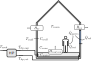

Building Model
--------------
Geometrical and physical parameters which specify different buildings are available in the data/buildings directory, e. g.
   - i4c_building : an energy efficient KFW 40+ house. Source: EnEV-Nachweis
   - sfh_58_68_geg : a single family home constructed in the building age class 1958-68, with an envelope refurbished according to the GEG regulations. Source: Tabula
   - sfh_84_94_soc : a single family home constructed in the building age class 1984-94, with an envelope in the state of construction. Source: Tabula

More buildings can be added by creating separate .py files containing a dictionary with the following parameters, which are easily accessible via the `TABULA web tool <https://webtool.building-typology.eu>`_ :
    - :math:`H_{ve}`       (H_ve)         : Heat transfer coefficient for ventilation (indoors --> ambient) [W/K]
    - :math:`H_{tr}`       (H_tr)         : Heat transfer coefficient for transmission (indoors --> ambient) [W/K]
    - :math:`H_{tr,light}` (H_tr_light)   : Heat transfer coefficient for transmission of light building components (windows and doors) (indoors --> ambient) [W/K] only needed for 5r2c calc method (ISO13790)
    - :math:`c_{bldg}`     (c_bldg)       : Specific heat capacity of the bldg [Wh/m^2/K]
    - :math:`A_{floor}`    (area_floor)   : Conditioned floor area  [m²]
    - :math:`h_{room}`     (height_room)  : Average height of the heated zone [m³]
    - :math:`T_{offset}`   (T_offset)     : optional parameter, only used for heating curve control [°C]
    - windows (list of dicts) - each dict contains:
        - area:     absolute window area [m²]
        - tilt:     tilt angle [degree]
        - azimuth:  azimuth angle, 0 = North, 180 = South [degree]
        - g-value:  total solar heat gain factor [-]
        - c_frame:  fraction of window that is opaque due to the frame [-]
        - c_shade:  shading factor due to external influences, e.g. trees [-]
    - position (dict) :
        - lat:      latitutde [degree]
        - long:     longitude [degree]
        - altitude: altitude above sealevel [m]
        - timezone: Timezone as defined `here <https://en.wikipedia.org/wiki/List_of_tz_database_time_zones>`_ 

.. automodule:: model_buildings 
   :members:
   :undoc-members:
   :show-inheritance: